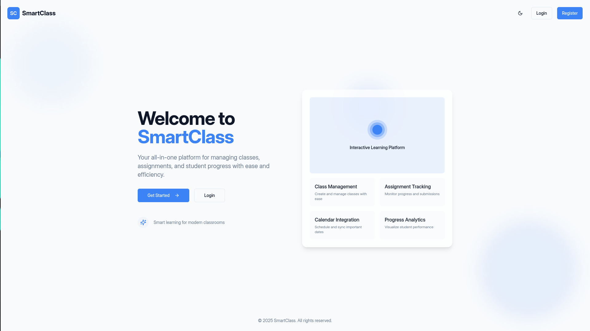
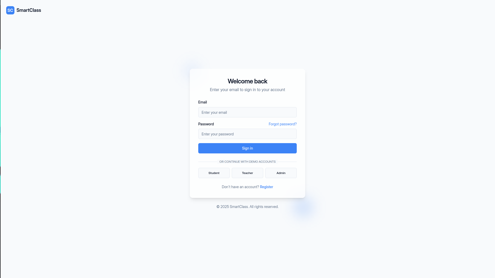
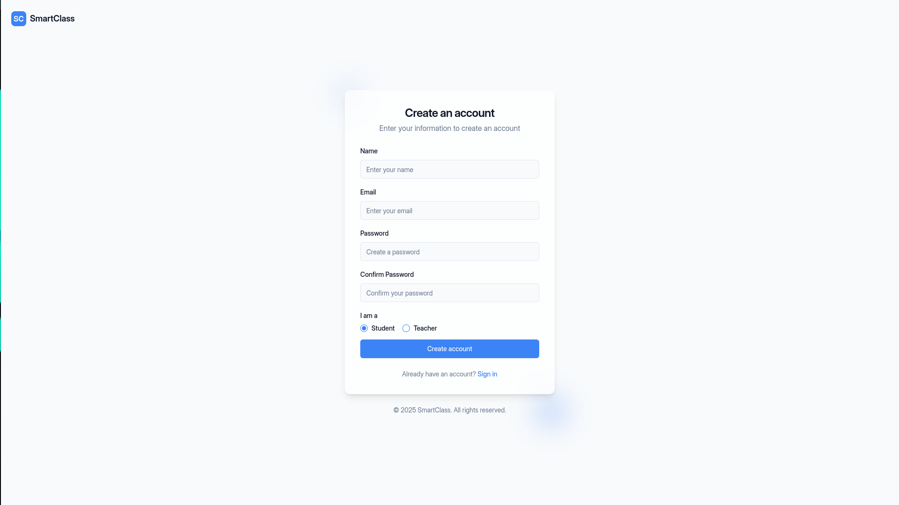
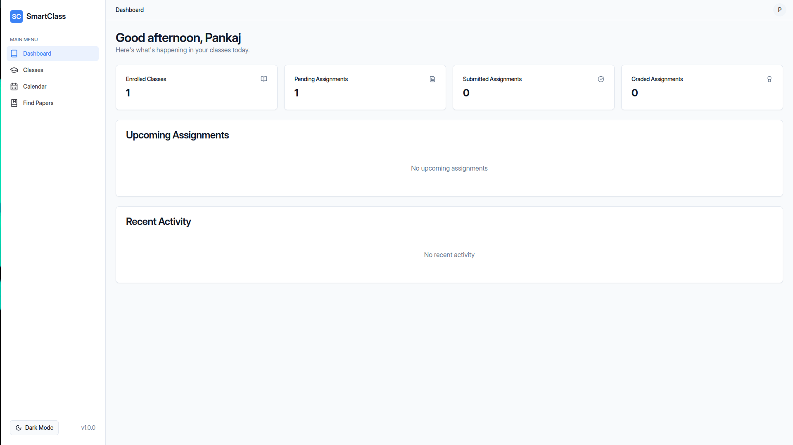
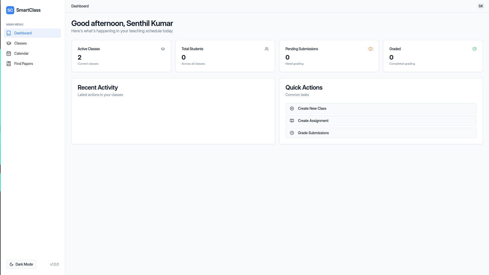
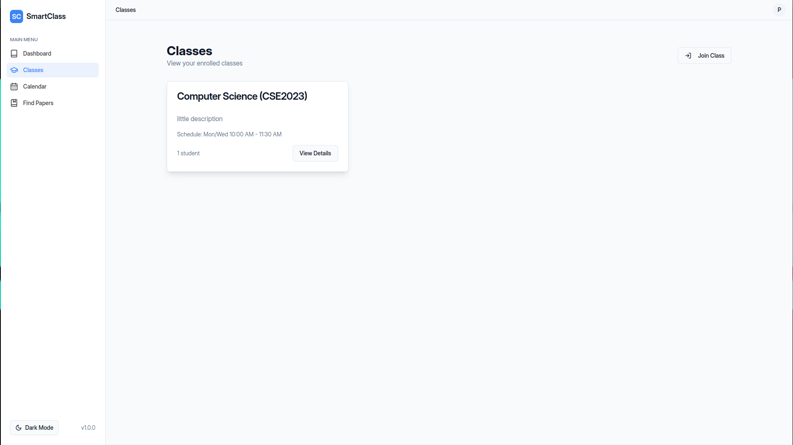
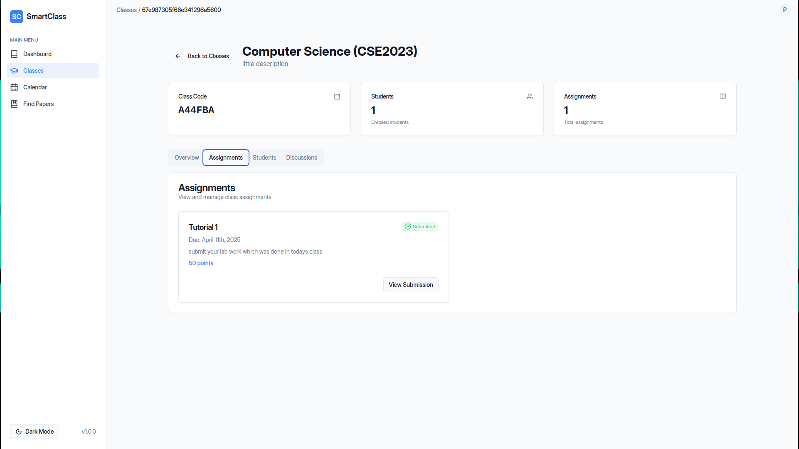
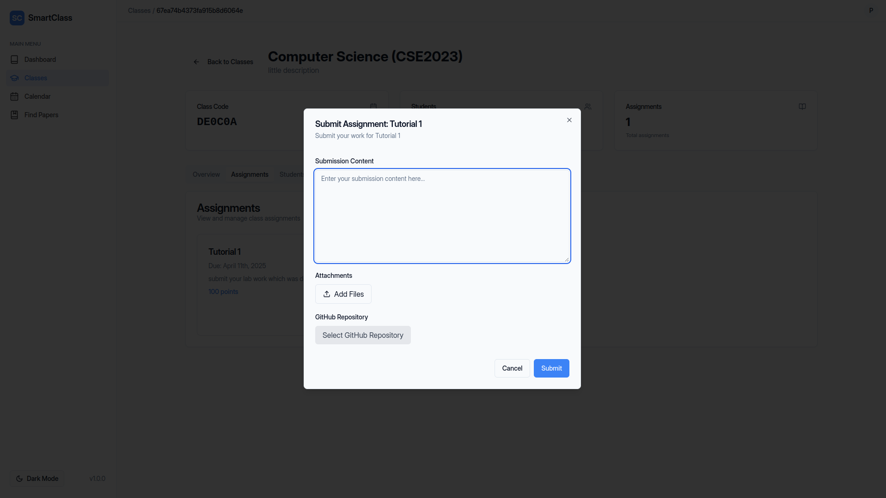
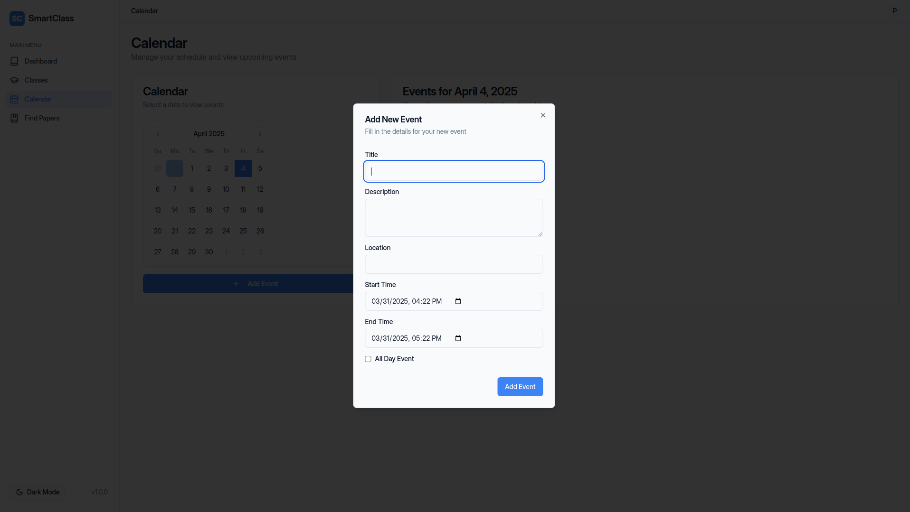
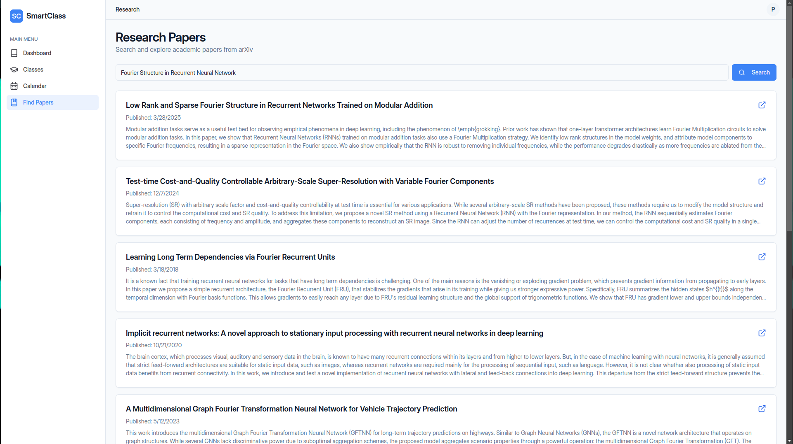

# SmartClass

A modern educational platform built with React, TypeScript, and Node.js that bridges the gap between students and teachers.


## 🌟 Features

- **User Authentication**
  - Secure login and registration system
  - Role-based access control (Student/Teacher)
  - JWT-based authentication

- **Course Management**
  - Create and manage courses
  - Upload course materials
  - Track student progress

- **Interactive Learning**
  - Real-time communication
  - File sharing capabilities
  - Progress tracking

- **Modern UI/UX**
  - Responsive design
  - Dark/Light mode
  - Intuitive navigation

## 🛠️ Tech Stack

### Frontend
- React 18
- TypeScript
- Vite
- TailwindCSS
- Shadcn UI Components
- React Query
- React Router DOM
- Zod for validation

### Backend
- Node.js
- Express
- TypeScript
- MongoDB with Mongoose
- JWT Authentication
- Multer for file uploads

## 🚀 Getting Started

### Prerequisites
- Node.js (v18 or higher)
- MongoDB
- npm or yarn

### Installation

1. Clone the repository
```bash
git clone https://github.com/ligMaBits/smartclass.git
cd smartclass
```

2. Install Frontend Dependencies
```bash
npm install
```

3. Install Backend Dependencies
```bash
cd backend
npm install
```

4. Set up environment variables
Create a `.env` file in the root directory:
```env
VITE_API_URL=http://localhost:5000
```

Create a `.env` file in the backend directory:
```env
PORT=5000
MONGODB_URI=your_mongodb_uri
JWT_SECRET=your_jwt_secret
```

5. Start the Development Servers

Frontend:
```bash
npm run dev
```

Backend:
```bash
cd backend
npm run dev
```

## 📸 Screenshots

### Homepage


### Authentication



### Dashboards



### Classes & Learning




### Additional Features


